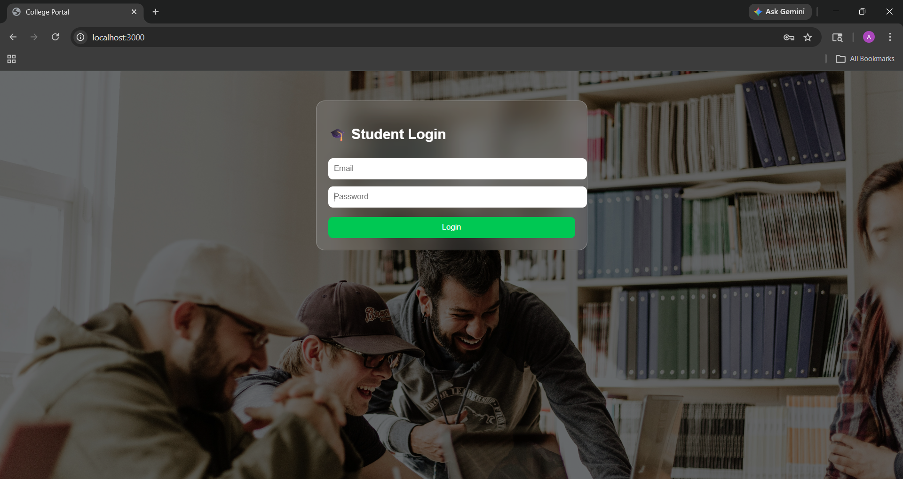
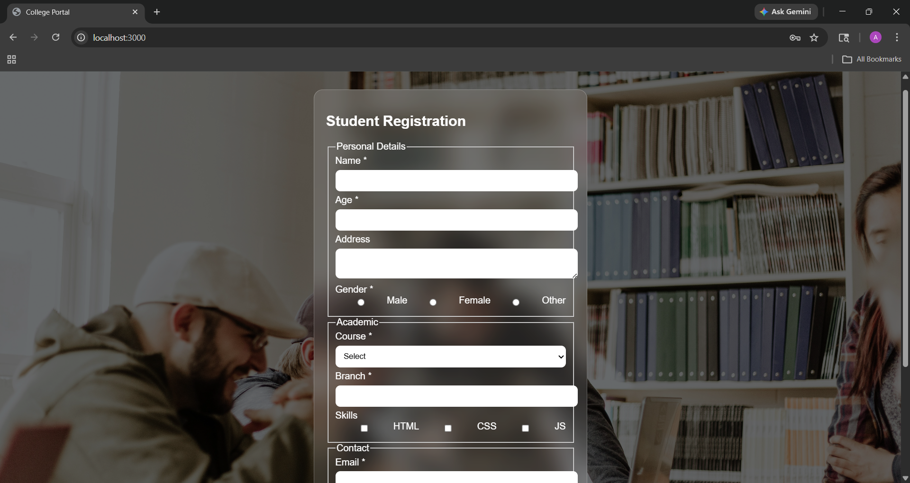

📘 Student Registration Hub

A modern full-stack student registration system built using HTML, CSS, JavaScript, Node.js, and Excel (XLSX) for data storage.

It allows students to log in, register their details, validate inputs, and store data securely in an Excel file through a backend server.

🚀 Features

✨ Modern login system
✨ Student registration form
✨ Real-time validations
✨ Gender selection (radio buttons)
✨ Course dropdown selection
✨ Skills checkbox system
✨ Optional image upload field
✨ Popup + toast notifications
✨ Success animation screen
✨ Data stored in Excel (.xlsx)
✨ Clean glassmorphism UI design
✨ Responsive and modern interface

🛠️ Tech Stack
🌐 Frontend: HTML, CSS, JavaScript
⚙️ Backend: Node.js, Express.js
📊 Database: Excel (xlsx file storage)
🎨 UI Design: Glassmorphism + Modern UI
📁 Project Structure
Student-Registration-Hub/
│
├── public/
│   ├── index.html
│   ├── style.css
│   └── script.js
│
├── server.js
├── students.xlsx (auto-generated)
├── package.json

🔐 Login Credentials (Demo)
Email: admin@gmail.com
Password: 1234

⚡ How to Run Locally

1️⃣ Install dependencies
npm install
2️⃣ Start server
node server.js
3️⃣ Open in browser
http://localhost:3000

📦 Install Dependencies

npm install express xlsx body-parser cors
📊 Data Storage

All registered student data is automatically stored in:

students.xlsx

Each entry includes:

Name
Age
Email
Phone
Course
Branch
Address
🎯 Validation Rules

✔ Age must be between 1 and 100
✔ Phone must be exactly 10 digits
✔ Email must end with @gmail.com
✔ Required fields must be filled

🎨 UI Highlights
Glassmorphism design 💎
Background image-based UI 🌄
Animated success screen 🎉
Popup error messages 🚨
Smooth transitions ⚡
📸 Preview

---login----

---registration----

---submission----

🌟 Future Improvements
🔥 MongoDB database integration
🔥 Admin dashboard (view students)
🔥 Edit/Delete student records
🔥 Authentication system (JWT)
🔥 PDF admission slip generator

👨‍💻 Author

Supriya Alisetty

📜 License

This project is open-source and free to use.

💡 Project Goal

To simulate a real-world college registration system with:

Clean UI
Validation logic
Backend integration
File-based data storage
Validation logic
Backend integration
File-based data storage
